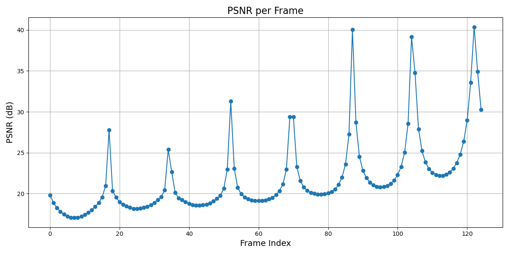

# EV_hw3 Report
## Where do I modify the parameters ?

| parameters | model = ficus_whitebg-trained (`material = "jelly"`) | model = wolf_whitebg-trained (`material = "sand"`)| 
|-------|-------|---|
| n_grid |utils/decode_param.py line 25: `material_params["n_grid"] = 50`|config/wolf_config.json line 23: `"n_grid": 200,` |
| substep_dt| config/ficus_config.json line 5:`"substep_dt": 1e-4,`|config/wolf_config.json line 9:`"substep_dt": 2e-5,`|
|grid_v_damping_scale|config/ficus_config.json line 13:`   "grid_v_damping_scale": 0.9999,`|config/wolf_config.json line 15:`"grid_v_damping_scale": 1.2,`|
|softening|mpm_solver_warp/mpm_solver_warp.py line 45: `self.mpm_model.softening = 0.1` |mpm_solver_warp/mpm_solver_warp.py line 45: `self.mpm_model.softening = 0.1` |

## Part 1 – PhysGaussian Baseline
- Default Jelly : https://youtube.com/shorts/TLgjPNqQPqU?feature=share
- Default sand : https://youtube.com/shorts/DjADCCTsTpk?feature=share

## Part2 - Exploring MPM Parameter Effects
### Jelly
- **Default parameters**: n_grid = 50, substep_dt = 1e-4, grid_v_damping_scale = 0.9999, softening = 0.1

|parameters|  PSNR plot| simulation video|
|----|---------|------|
| n_grid = 25, others = default |  |https://youtube.com/shorts/rTu4iW80EgY|
| n_grid = 1, others = default |  |https://youtube.com/shorts/D8CyaR2WzO4|
| substep_dt = 1e5, others = default |  |https://youtube.com/shorts/tgZL9_Pog6k|
| substep_dt = 4e5, others = default |  |https://youtube.com/shorts/7Bhq68hE348?feature=share|
| softening = 1, others = default |  |https://youtube.com/shorts/6mmsztDRHxg|
| softening = 10, others = default |  |https://youtube.com/shorts/Q_F7wSJ5nwk|
| softening = 0.01, others = default |  |https://youtube.com/shorts/d2xLYEBOZgw|
| grid_v_damping_scale = 0.5, others = default |  |https://youtube.com/shorts/hpPQaf201Fs|
| grid_v_damping_scale = 2, others = default |  |https://youtube.com/shorts/k3T-C3remxE?feature=share|

### Sand
- **Default parameters**: n_grid = 200, substep_dt = 2e-5, grid_v_damping_scale = 1.2, softening = 0.1

|parameters| PSNR plot| simulation video|
|----|---------|------|
| n_grid = 100, others = default |  |https://youtube.com/shorts/WdaBIuRJcgM?feature=share|
| n_grid = 400, others = default |  | https://youtube.com/shorts/3p2t0prPY-w |
| substep_dt = 1e5, others = default |  | https://youtube.com/shorts/k0jxBlM7B9Q?feature=share|
| substep_dt = 4e5, others = default |  | https://youtube.com/shorts/r-xnR473ZzE|
| softening = 1, others = default |  |https://youtube.com/shorts/wHNnv5gM-Hc |
| softening = 10, others = default |  | https://youtube.com/shorts/90xITuTU42c |
| softening = 0.01, others = default |  | https://youtube.com/shorts/TZvwzmAXj58|
| grid_v_damping_scale = 0.5, others = default |  |https://youtube.com/shorts/j1jbGWG0Eis|
| grid_v_damping_scale = 2, others = default |  |https://drive.google.com/file/d/1zFYQODVNvqrtxLwdIoLt0aALkZwpXMIJ/view?usp=sharing|

### My Findings
- In jelly,
    - All PSNR curves exhibit periodic variation except for softening. I assume this is due to the regular oscillation of the moving stick in the video, which causes consistent deformations and periodic drops in PSNR values.

    - The softening curve has the highest average PSNR among all (although it drops with time). I assume that increasing the softening factor leads to deformations that resemble the ground truth more closely, thus maintaining higher PSNR and reducing sensitivity to stick movement.

    - The substep_dt curve shows visible fluctuations, especially during impact moments. I assume that improper time stepping causes instability during high-speed interactions, leading to sudden visual artifacts and PSNR drops.

    - The double-peak patterns observed in the later frames may indicate aliasing or inaccurate resolution of force propagation when substep_dt is not well-tuned. This suggests that tuning substep size is critical for stable and accurate rendering of dynamic materials like jelly.

    - The grid_v_damping_scale curve varies periodically as well. I assume that excessive damping suppresses natural motion, while insufficient damping causes overreaction upon collision. Both affect the visual realism and PSNR values cyclically.

    - The n_grid curve fluctuates more irregularly. I assume that mismatched resolution between grid and particles causes aliasing or oversmoothing, which becomes more apparent during deformation, thus degrading PSNR.
- In sand,
    - All PSNR curves, except for softening, exhibit a consistent and monotonic decay throughout the frames. I assume that this drop reflects the accumulation of simulation error or resolution mismatch as the material behavior becomes more complex over time.

    - The lack of periodicity indicates that the sand motion is relatively stable and does not involve repetitive or oscillatory deformation like jelly.

    - The softening curve also decreases over time but maintains high PSNR for a longer duration, with a steep drop occurring only after frame 20. I assume that softening won't affect the PSNR values.

## Bonus
To automatically infer material parameters in PhysGaussian, we can design a neural framework that takes input video or multiview sequences and predicts simulation parameters (e.g., softening, damping, grid resolution). This prediction model (e.g., CNN or Transformer) can be trained end-to-end by comparing the rendered results from PhysGaussian (using predicted parameters) with the input video using image-based losses (like PSNR or LPIPS). This enables generalization to unknown materials without manual tuning.

